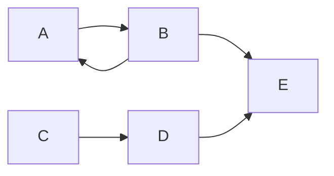

# Markdown

## 1. Básico

### Formato de texto
Estas son las formas más simples de formatear texto en markdown:

```markdown
Formatos de texto
**Texto en negrita** con 2 asteriscos
*Texto en cursiva* con 1 asterisco
~~Texto tachado~~ con doble virgulilla
***Texto en negrita y cursiva*** con 3 asteriscos
```

```
Títulos de diferentes tamaños
# titulo1
## titulo2
### titul3
#### titulo4
##### titulo5
###### titulo6
```
y se verá así:

# *titulo1 en cursiva*
## **titulo2 en negrita**
### ~~titulo3 tachado~~
#### ***titulo4 en negrita y cursiva***
##### titulo5
###### titulo6


### Listas
Estas son las formas más simples de crear listas:

```
Formas de crear listas:


Lista ordenada:
1. Primer elemento
2. Segundo elemento
3. Tercer elemento

Lista desordenada:
- Primer elemento
- Segundo elemento
- Tercer elemento

Lista anidada:
1. Primer elemento
   - Subelemento 1
   - Subelemento 2
2. Segundo elemento
```

Como se vé:

Lista ordenada:
1. Primer elemento
2. Segundo elemento
3. Tercer elemento

Lista desordenada:
- Primer elemento
- Segundo elemento
- Tercer elemento

Lista anidada:
1. Primer elemento
   - Subelemento 1
   - Subelemento 2
2. Segundo elemento

---
## 2. Gráfico

```
Enlaces y referencias:

Enlaces a páginas:
<https://www.google.com> - URL directa
[Enlace a Google](https://www.google.com) - Enlace con texto
[Enlace con título y texto alternativo](https://www.google.com "Google's Homepage") - Enlace con título y texto alternativo

Enlace a otra páginas del sitio:
[Enlace a la página de inicio](/) - Enlace a la página de inicio
[Enlace a una página](ruta) - Enlace a una página específica


Citas multimedia:
 - Imagen con texto alternativo

(uniendo los < y > a los corchetes)
{{ <youtube codigoVideo> }} - Ventana de video de youtube


Citas en bloque:
> Esto es una cita en bloque
> > Esto es un bloque anidado
> >
> > con varios parrafos
> > ### y otros elementos dentro


```
Como se vé:

<https://www.google.com>

[Enlace a Google](https://www.google.com)

[Enlace con título y texto alternativo](https://www.google.com "Página inicial de google")

[Enlace a la página de inicio](/)

[Enlace a una música](../musica) 




> Esto es una cita en bloque
> > Esto es un bloque anidado
> >
> > con varios parrafos
> > ### y otros elementos dentro




Como se vé:

graph LR;

A --> B
B --> A
C --> D
B --> E
D --> E

---

## 3. Extendido

```
Así se hace una tabla:
| Encabezado 1 | Encabezado 2 |
|--------------|--------------|
| Celda 1      | Celda 2      |
| Celda 3      | Celda 4      |

Con el contenido alineado:
| Izquierda | Centro | Derecha |
|:----------|:------:|--------:|
| Texto     | Texto  | Texto   |

Creacion de notas:

```

Como se vé:

| Encabezado 1 | Encabezado 2 |
|--------------|--------------|
| Celda 1      | Celda 2      |
| Celda 3      | Celda 4      |

| Izquierda | Centro | Derecha |
|:----------|:------:|--------:|
| Texto     | Texto  | Texto   |

- [x] Tarea completada
- [ ] Tarea pendiente
- [ ] ~~Tarea cancelada~~